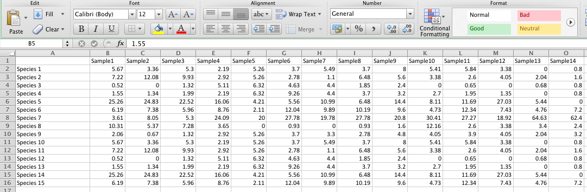

**Js Script For Illustrator**

Micropaleontologists often document in graphics datasets consisting of abundance (generally expressed as percent relative to the total amount of a specific group) of species (or genera, morphogroups, etc.) from analyzed samples. This usually results in the creation of columns where each column is the representation of a species with the values from each sample represented vertically (first samples is the lowermost while the last samples is the uppermost). The purpose of this script is to generate such graphics that can be later modified in Illustrator and used in papers, presentations, etc. Please bear in mind that the script is not adapted to any number of samples, columns, etc. It is intended to save people from wasting tremendous amount of time in Illustrator  trying to represent datasets.  The source code is well documented with comments and it is easy to modify. However, if you would like to make modifications it would be nice to nofity me:) 

**Version 1** *(illustrator_JS_v1.jsx)*

The percent abundance is represented for each sample relative to the maximum percent of the specific species from the dataset. For example, if a certain species has a maximum value of 64% from all samples, the representation will be relative to 70% (the maximum rounded to the nearest 10), thus visually enhancing the oscillations in abundance of the species but visually weak when compared with the community. This version is useful when your dataset contains numerous species with low abundance.

**Version 2** *(illustrator_JS_v2.jsx)*

The percent abundance is represented for each sample relative to the total of the community (meaning 100%).
This version is useful when your dataset contains fewer species but abundant.

**The generated graphic has the following features:**

 - A4 sized document
 - Landscape orientation
 - Supports the representation of a maximum of 20 columns with data
 - Basic colours and fonts

**Please bear in mind:**

 - Dataset with a number of samples less than five and a number of species less than six or seven generates correct, but weird looking graphics
 - Increasing number of samples decreases readability of sample names

**Prepare your data file**

Only CSV (Comma Separated Values) files are supported. To prepare your CSV file with the data:

- Open your Excell file that contains the data to be used

In order for the script to work properly, your Excell sheet should be organized the following way:

- First row should contain the names of the samples beginning with an empty cell (first column) (see picture below)
 - Rest of the rows contain the name of the species/genera/group (first column) followed by the abundance value of the specific species in each sample (see picture below)

- Save your Excell file to CSV format (From the menu bar select *File* -> *Save as* and from the dropdown menu select the format: *CSV*).

**Use script in Illustrator**

- Open Illustrator.
- From the menu bar select *File* -> *Scripts* -> *Other Script…*
- Browse to the folder you saved the script, select the script and open it
- After opening the script a window appears to select your CSV file. Browse to your file, select and open it.
- That's it!

For further information, comments or if you stumble upon issues please write me an e-mail: szekelyflavius@gmail.com.

